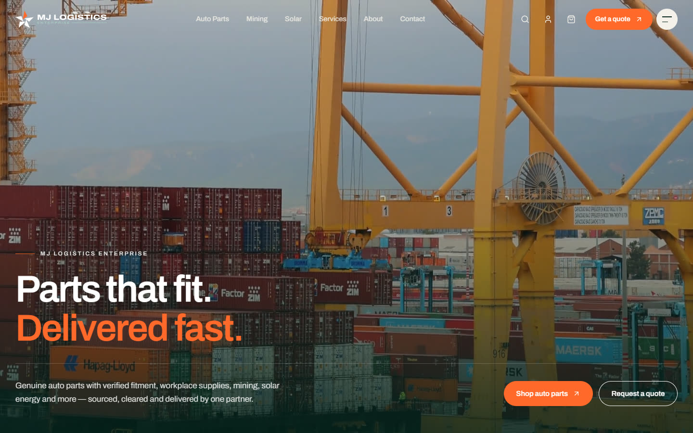
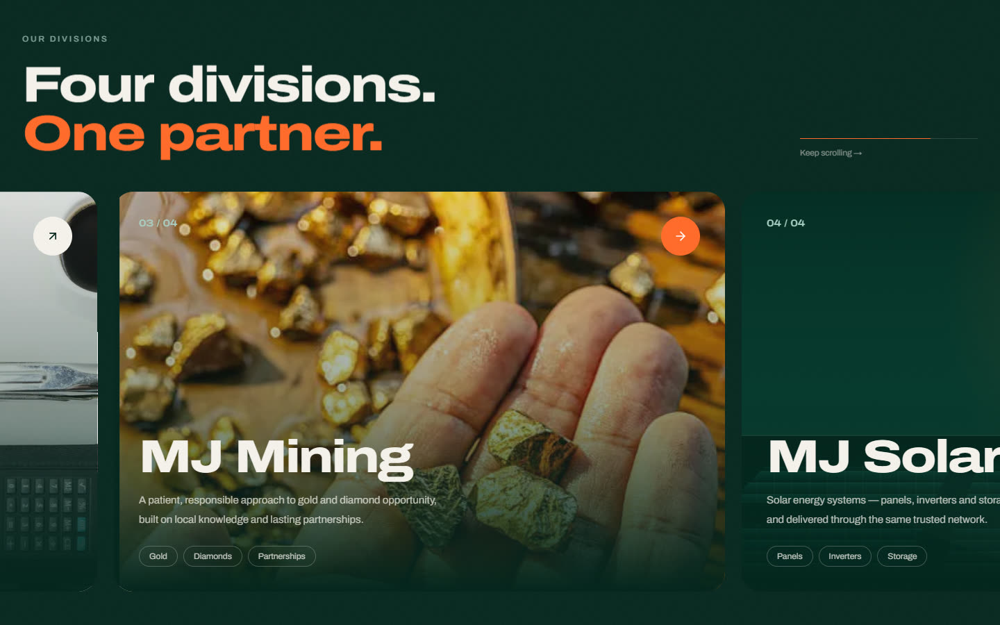
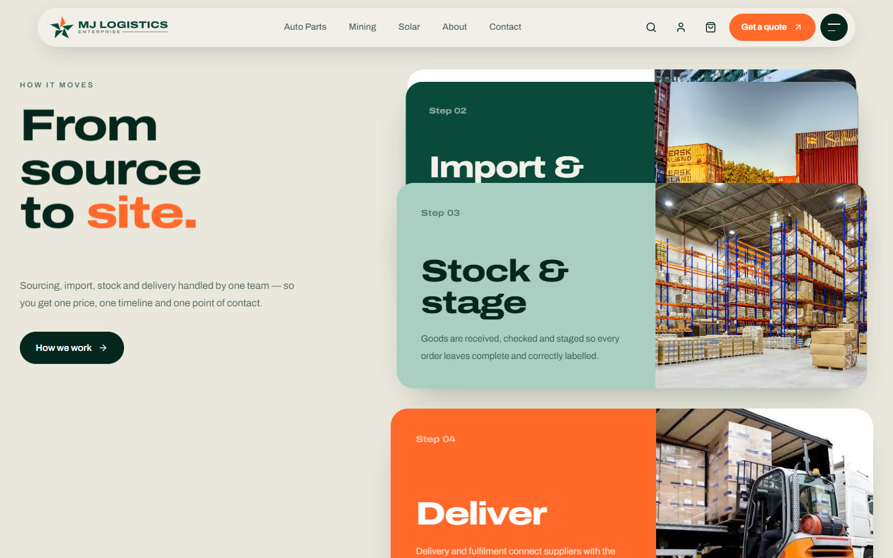
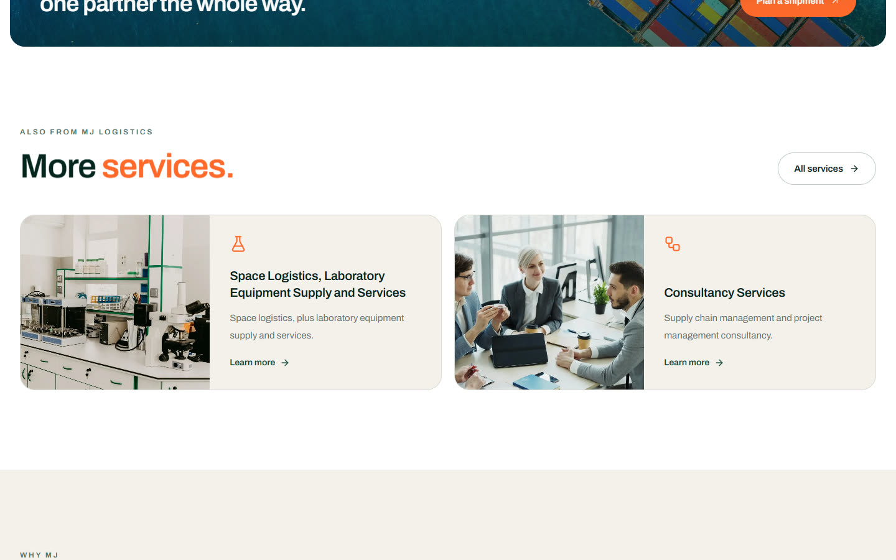
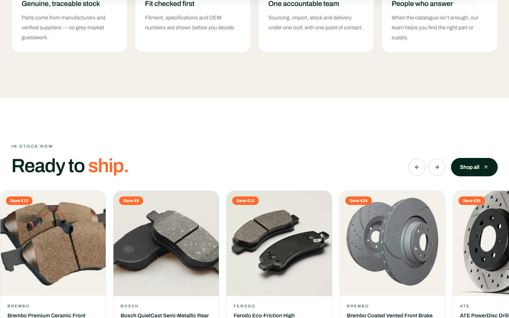
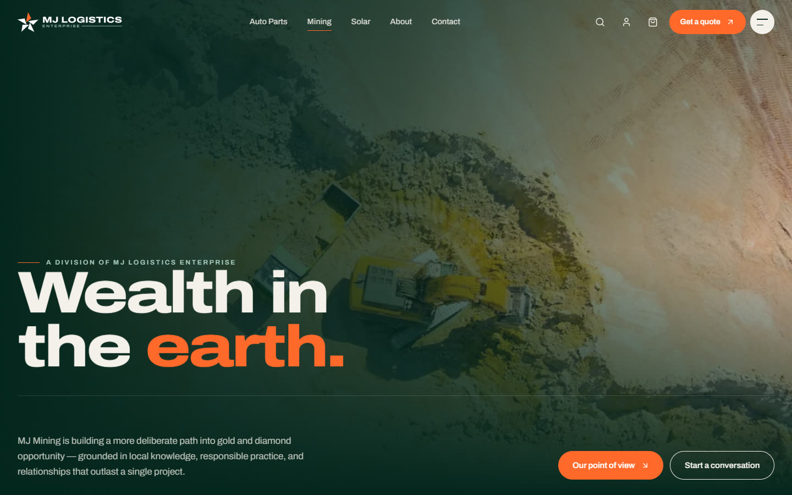
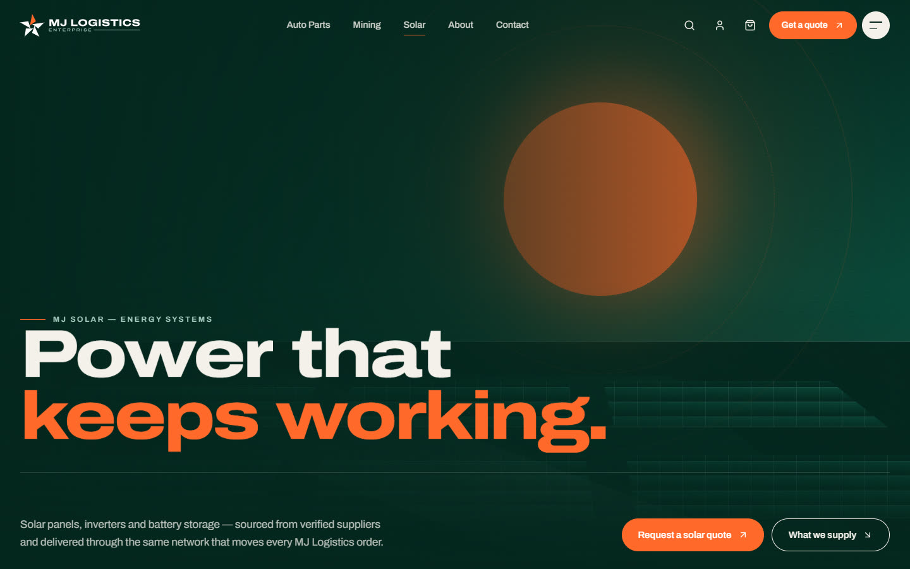
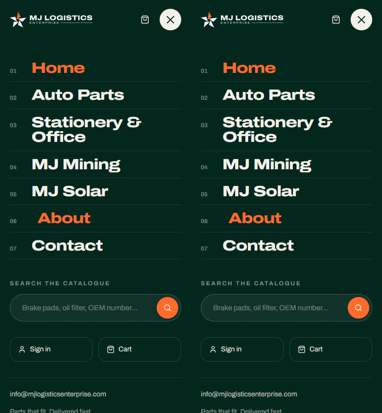

<div align="center">

<picture>
  <source media="(prefers-color-scheme: dark)" srcset="frontend/public/brand/mj-horizontal-reversed.svg">
  
</picture>

### Parts that fit. Delivered fast.

The website and online store for **MJ Logistics Enterprise**: genuine auto parts with verified
fitment, plus office supplies, mining, solar energy, laboratory equipment and consultancy. One company sources, imports and
delivers all of it.

[**mjlogisticsenterprise.com**](https://mjlogisticsenterprise.com)


</div>

<br>



## Overview

The site has two parts:

| | What it is | Where it runs |
|---|---|---|
| **Storefront** | The company pages (home, divisions, about, contact) and the full parts store: catalogue, vehicle fitment, search, garage, cart | Static Next.js export on **Hostinger** |
| **Admin and accounts** | `/admin` catalogue console, Google and Apple sign-in, part images | FastAPI on **Render** + Postgres + Cloudinary |

The storefront reads its catalogue from `frontend/lib/data/*` when the site is built, so it never
waits on the API. Only `/admin` and sign-in talk to the backend.

## Highlights

**A brand-led, animated company site**
- Smooth scrolling with [Lenis](https://github.com/darkroomengineering/lenis), driven by GSAP's ticker so it stays in sync with ScrollTrigger
- A first-visit preloader where the logo pieces fly together, and an emerald curtain between pages
- Headlines that rise word by word, statements that light up as you scroll, images that wipe open and drift, and marquees that speed up with scrolling
- A pinned sideways-scrolling strip of the divisions, stacking process cards, and an image that expands to full screen
- Magnetic buttons, a cursor follower, and a full-screen menu with image previews and catalogue search
- Everything respects `prefers-reduced-motion`, and no content is hidden if JavaScript doesn't run

**A store built to sell**
- Vehicle-first catalogue: System → Subsystem → part list, with fitment checks against the saved vehicle
- VIN or registration lookup and Make → Model → Generation → Engine selector, saved in My Garage
- Product pages with specifications, OEM references and a "fits these vehicles" list
- Cart and checkout behind sign-in, plus in-stock highlights and add-to-cart on the homepage

<table>
  <tr>
    <td></td>
    <td></td>
  </tr>
  <tr>
    <td></td>
    <td></td>
  </tr>
  <tr>
    <td></td>
    <td></td>
  </tr>
</table>

<p align="center"></p>

## Divisions

| Division | Route | Summary |
|---|---|---|
| Auto Parts | `/shop`, `/catalog` | Genuine parts with verified fitment |
| Stationery & Office | `/stationery` | Writing, paper, filing, printing and desk supplies |
| MJ Mining | `/mining` | Responsible gold and diamond opportunity |
| Solar Energy | `/solar` | Solar energy systems and equipment, supplied to order |
| Services | `/services` | Space logistics and laboratory equipment; supply chain and project management consultancy |

## Tech stack

- **Frontend:** Next.js 14 (Pages Router, `output: 'export'`), React 18, TypeScript, Tailwind CSS 4
- **Motion:** GSAP 3 + ScrollTrigger, Lenis, Motion (Framer Motion)
- **Backend:** FastAPI, SQLAlchemy and Postgres (accounts), Authlib (Google and Apple OAuth), Cloudinary (part images)
- **Hosting:** Hostinger (static storefront), Render (API and database, set up in `render.yaml`)

## Project structure

```
mj-logistics/
├── frontend/
│   ├── pages/              # routes: company pages, shop, catalog, parts, admin
│   ├── components/
│   │   ├── fx/             # motion primitives: SplitText, Marquee, Magnetic, Preloader, …
│   │   ├── SiteHeader.tsx  # company-site header and full-screen menu
│   │   ├── SiteFooter.tsx  # shared footer
│   │   └── Header.tsx      # store header (search and vehicle selector)
│   ├── lib/
│   │   ├── fx.ts           # scroll animations driven by data-* attributes
│   │   ├── useLenis.ts     # smooth scroll wired into GSAP
│   │   └── data/           # catalogue, parts and vehicles, read at build time
│   ├── styles/globals.css  # brand tokens (@theme), type scale, motion base states
│   └── public/             # brand/, fonts/archivo/, images/, videos (not in git)
├── backend/app/            # FastAPI: routers/, auth, db, cloudinary_config
├── logo/                   # master logo kit (SVG, PNG, icons, fonts)
├── docs/screenshots/       # images used in this README
└── render.yaml             # Render blueprint for the backend
```

## Getting started

**Frontend**

```bash
cd frontend
npm install
npm run dev        # http://localhost:3000
npm run build      # static export to frontend/out/
```

The homepage hero plays `public/hero-video.mp4` (desktop) and `public/logistics-mobile.mp4` (phones).
Video files are gitignored because of their size, so add them locally before building. If they're
missing, the hero shows `public/images/site/hero-poster.webp` instead.

**Backend**

```bash
cd backend
pip install -r requirements.txt
uvicorn app.main:app --reload --port 8000   # docs at http://localhost:8000/docs
```

The frontend expects the API at `http://localhost:8000` unless you set `NEXT_PUBLIC_API_BASE` in
`frontend/.env.local`. Set Cloudinary and OAuth credentials through environment variables (see
[`AUTH-SETUP.md`](AUTH-SETUP.md)).

## Deployment

- **Storefront:** [`HOSTINGER-DEPLOY.md`](HOSTINGER-DEPLOY.md). Build, then upload `frontend/out/` to Hostinger.
- **Backend:** Render auto-deploys from `main` using [`render.yaml`](render.yaml). See [`README-DEPLOY.md`](README-DEPLOY.md).

## Brand

| Token | Hex | Use |
|---|---|---|
| `ink` | `#04261D` | Dark sections, body text |
| `forest` | `#0A4A3A` | Deep Emerald, the primary brand colour |
| `sage` | `#4F7268` | Secondary text, labels |
| `mint` | `#A9CFC2` | Accents on dark backgrounds |
| `signal` | `#FF6A2B` | Signal Orange, for calls to action and highlights |
| `paper` | `#F3F1EA` | Page background |

Type: **Archivo Expanded** for headings (from the logo kit) and **Archivo** for body text, both under
the SIL Open Font License. The full logo kit is in [`logo/`](logo/).

## Project notes

- [`CLAUDE.md`](CLAUDE.md): working rules and conventions for this repo
- [`CHAT_HISTORY.md`](CHAT_HISTORY.md): log of what each working session changed
- [`COMMIT_HISTORY.md`](COMMIT_HISTORY.md): generated from `git log` by `scripts/update-commit-history.ps1`

---

<sub>© MJ Logistics Enterprise. All rights reserved. Proprietary client project; not licensed for reuse.</sub>
